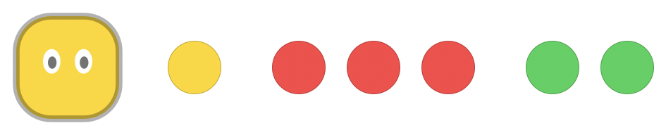

# 🟢🟡🔴 Claude Traffic Light

**A tiny macOS menu bar app that shows what every Claude Code session is doing — at a glance.**


<p align="center">
  
</p>

Running Claude Code in three terminals and can't tell which one is sitting there waiting on
you? Claude Traffic Light puts a little **Claude bot** in your menu bar that turns **red when
it's working, yellow when it needs you, and green when it's done** — for all your sessions at
once. No more hunting through tabs to find the one stuck on a permission prompt.

It's a single ~200 KB native binary with **zero runtime dependencies** — the state comes
straight from Claude Code's own hooks.

## The idea

It's a "busy light" for your AI pair:

| Color | Meaning |
|:---:|---|
| 🔴 **Red** | At least one session is **working** — busy, don't interrupt. |
| 🟡 **Yellow** | A session is **blocked on a prompt** and needs you to approve / press enter. *This is the one that matters.* |
| 🟢 **Green** | Everything's **ready** — idle, or just finished and waiting for your next message. |

The icon reflects the most urgent state, and it updates **instantly** (~3 ms, via a file
watcher). The moment a session needs you, it can fire a sound + notification — so you can walk
away from a long task and get pulled back the second it's blocked or done.

## See every shell at once

Open more than one session and the mascot grows a row of dots — one per shell, sorted
most-urgent-first and grouped by color:

<p align="center">
  
</p>

*One needs you · three working · two ready* — readable without clicking anything. (It caps at
six dots and shows the rest as a `+N`.) Click the icon for the full list, by project:

```
Claude   ·   1 needs you   ·   3 working   ·   2 ready
────────────────────────────────────────────────────
🟡  api-gateway      needs you      ← click any row to jump to its terminal
🔴  web              working
🔴  worker           working
🟢  notes            done
────────────────────────────────────────────────────
✓ Alert on permission prompts
✓ Alert when a turn finishes
────────────────────────────────────────────────────
Quit                                              ⌘Q
```

## Features

- 🎯 **One glanceable icon** — aggregate state across all sessions, most-urgent wins.
- 👀 **Per-shell dot strip** — see each session's state without opening anything.
- ⚡ **Instant alerts** — sound + banner the moment a session is blocked or finishes (each is a separate toggle).
- 🖱️ **Click to focus** — jump to a session's terminal (precise on iTerm2 / Terminal / tmux; best-effort on Ghostty).
- 🏷️ **Labeled by project** — sessions are named by their working directory, de-duplicated when they collide.
- 🧩 **Zero runtime deps** — one native AppKit binary; the hooks are plain bash + `jq`.
- 🎨 **Yours to tweak** — drop in your own mascot, retune the decay timers, relocate the state dir.

## Quick start

**Requirements:** macOS 13+ · Xcode Command Line Tools (`xcode-select --install`) · `jq` (`brew install jq`)

```bash
git clone https://github.com/MitchelMckee/claude-traffic-light.git
cd claude-traffic-light

./build.sh                              # compile ClaudeTrafficLight.app
./install.sh                            # wire hooks into ~/.claude/settings.json (backs up first)
open build/ClaudeTrafficLight.app       # run it
./autostart.sh                          # optional: also launch at login
```

Restart any already-running Claude Code sessions so they pick up the hooks — new ones report
immediately. The first time you click a session to focus its terminal, macOS asks for
**Automation** (and, for Ghostty/Terminal window-raising, **Accessibility**) permission — grant
it once.

> Alerts are posted via `osascript`, so macOS attributes them to **Script Editor**. If banners
> don't show, enable notifications for *Script Editor* in System Settings → Notifications. The
> sound plays regardless.

## How it works

```
Claude Code hooks ─▶ ~/.claude/hooks/cc-hook.sh ─▶ ~/.claude/menubar-state/<session>.json
                                                          │   (one tiny file per session)
                                                          ▼
                                          ClaudeTrafficLight.app watches the dir,
                                          aggregates a color, draws the icon + menu
```

Each Claude Code hook event runs a small bash script that writes/updates one JSON file per
session. The app watches that directory (instant, via a kqueue file-system source, plus a 2 s
tick for time-based decay) and renders the aggregate. **It only ever tracks Claude Code
sessions** — a plain shell, an editor, or an SSH session never fires a hook, so it never shows
up. Sessions that crash are pruned via a `kill(pid, 0)` liveness check.

**Event → state:**

| Hook event | State | Color |
|---|---|:---:|
| `UserPromptSubmit`, `PreToolUse`, `PostToolUse`, `PreCompact` | working | 🔴 |
| `Notification` (permission / confirm prompt) | needs you | 🟡 |
| `Stop` (turn finished) | ready | 🟢 |
| `SessionStart` | ready | 🟢 |
| `SubagentStop`, idle nudge | *ignored* | — |
| `SessionEnd` / dead process | removed | — |

**Decay** (so stale states don't lie — tunable in `Sources/StateStore.swift`): a finished turn
fades to plain idle after 5 min; a working session with a live `claude` process never falsely
decays (so long builds stay red); an abandoned permission prompt relaxes after 30 min.

## Customize

- **Your own mascot:** drop a `mascot-mask.png` (a silhouette — alpha = shape) in
  `~/.claude/menubar-state/` or `Contents/Resources/`; it gets recolored by state.
- **Decay timers:** `DecayConfig` in `Sources/StateStore.swift`.
- **Alert delay / sound:** `alertDwell` and the `"Glass"` sound in `Sources/AppDelegate.swift`.
- **Dot cap:** `kMaxStatusDots` in `Sources/MascotIcon.swift`.
- **Relocate state files:** set `CC_MENUBAR_STATE_DIR` (honored by both the hook and the app).

## Limitations

- **Ghostty** has no window-focus API, so clicking a Ghostty session activates the app and
  best-effort raises the window matching the project name — not a specific tab. iTerm2,
  Terminal, and tmux get precise focus.
- A single tool call running longer than ~10 min with no other hook activity *and* an
  unknown PID will read as idle; live-PID sessions are unaffected.
- Notifications use `osascript` (no signing required); a signed/notarized build could switch to
  `UNUserNotificationCenter` for click-to-focus banners.

## Uninstall

```bash
./uninstall.sh    # unwires the hooks, removes the script + state dir + login item
```

Then Quit the app from its menu. Your original settings are kept as
`~/.claude/settings.json.bak.<timestamp>`.

## License

MIT © Mitchel McKee — see [LICENSE](LICENSE).

*Not affiliated with Anthropic. "Claude" and the mascot likeness belong to their respective owners; this is a fan-made utility.*
